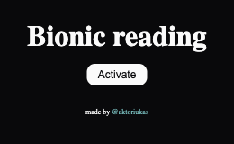

# Bionic Reading

A tiny Chrome extension that bolds the first half of every word on a page, so your
eyes can skim the rest.

**[⬇️ Install from the Chrome Web Store](https://chromewebstore.google.com/detail/bionic-reading/jcfpacpddhgcfenlmaacfabpfffdplhl)**

## What it does

Your eyes don't glide across a line of text — they jump, pause, and jump again. Most
of what identifies a word sits in its opening letters, so the beginning is usually
enough to recognise it before your eye has finished arriving.

This extension emphasises that beginning. Click the toolbar icon, hit **Activate**,
and the text on the current page is re-rendered with the front of each word in bold.
Nothing is hidden, reworded or sent anywhere — the page you were reading stays the
page you were reading.

## Screenshots

| Before | After |
| --- | --- |
|  |  |

The popup is a single button — click it again to switch the page back:



## Install

**From the Chrome Web Store** — [Bionic Reading](https://chromewebstore.google.com/detail/bionic-reading/jcfpacpddhgcfenlmaacfabpfffdplhl).

**From source** (for development, or to run your own changes):

1. Clone the repo, or download it as a zip and unzip it:
   ```bash
   git clone https://github.com/aktoriukas/bionic_reading.git
   ```
2. Go to `chrome://extensions/`.
3. Enable **Developer mode**.
4. Click **Load unpacked** and choose the folder.

## How it works

Clicking **Activate** injects [`src/convert.js`](src/convert.js) into the active tab
(and its frames). That script walks the text nodes inside `p`, `font`, `span` and
`li` elements and wraps the first half of each word in a `<br-bold>` tag, styled bold
by an injected stylesheet. Clicking again toggles the class off rather than reloading
anything.

A few deliberate exceptions:

- Words containing digits are left alone, so dates, prices and version numbers stay readable.
- Hyphenated words are split and bolded part by part.
- Words of three characters or fewer get only their first letter bolded.

## Permissions

| Permission | Why |
| --- | --- |
| `activeTab`, `scripting` | To inject the converter into the tab you're looking at, only when you click the button. |
| `host_permissions: https://*/*` | So the converter can run on the https pages you activate it on. |

Nothing is collected, stored or transmitted. The extension has no server and no
analytics; the only state it keeps is whether the button currently reads "Activate"
or "Deactivate".

## Known limits

- Only https pages are covered — plain http pages are out of scope of the manifest's host permissions.
- Conversion runs once, on click. Content loaded afterwards (infinite scroll, single-page-app navigation) isn't converted until you toggle again.
- Headings and other tags outside `p` / `font` / `span` / `li` are left as they are.

## License

[MIT](LICENSE) © Gediminas Strumila — made by [@aktoriukas](https://www.aktoriukas.com/).
