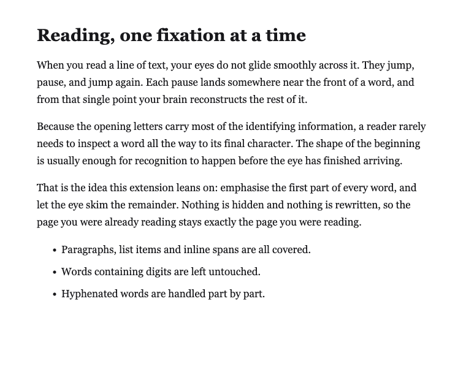
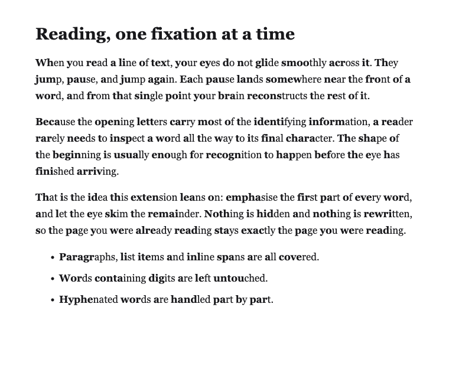

# Bionic Reading

A tiny Chrome extension that bolds the first half of every word on a page, so your
eyes can skim the rest.

**[⬇️ Install from the Chrome Web Store](https://chromewebstore.google.com/detail/bionic-reading/jcfpacpddhgcfenlmaacfabpfffdplhl)**

## What it does

Your eyes don't glide across a line of text — they jump, pause, and jump again. Most
of what identifies a word sits in its opening letters, so the beginning is usually
enough to recognise it before your eye has finished arriving.

This extension emphasises that beginning. Click the toolbar icon and hit **Turn on**,
or press **Alt+Shift+B**, and the text on the current page is re-rendered with the
front of each word in bold. Enable **Keep enabled on new pages** to apply it as you
browse. Nothing is hidden, reworded or sent anywhere.

## Screenshots

| Before | After |
| --- | --- |
|  |  |

## Install

**From the Chrome Web Store** — [Bionic Reading](https://chromewebstore.google.com/detail/bionic-reading/jcfpacpddhgcfenlmaacfabpfffdplhl).

**From source** (for development, or to run your own changes):

1. Clone the repo, or download it as a zip and unzip it:
   ```bash
   git clone https://github.com/aktoriukas/bionic_reading.git
   ```
2. Go to `chrome://extensions/`.
3. Enable **Developer mode**.
4. Click **Load unpacked** and choose the folder.

## How it works

Clicking **Turn on** or using the shortcut injects [`src/convert.js`](src/convert.js)
into the active tab and its frames. That script walks the text nodes inside `p`,
`font`, `span` and `li` elements and wraps the first half of each word in a
`<br-bold>` tag. Clicking again toggles the styling off. The optional persistence
setting is synced by Chrome and tells the service worker to apply the converter when
a new page finishes loading.

A few deliberate exceptions:

- Words containing digits are left alone, so dates, prices and version numbers stay readable.
- Hyphenated words are split and bolded part by part.
- Words of three characters or fewer get only their first letter bolded.

## Permissions

| Permission | Why |
| --- | --- |
| `activeTab`, `scripting` | To inject the converter into the tab you're looking at. |
| `storage` | To sync the optional persistence setting. |
| `host_permissions: https://*/*` | So persistence can apply the converter to https pages as they load. |

Nothing is collected or transmitted. The extension has no server and no analytics;
it stores only the persistence preference in Chrome's synced extension storage.

## Known limits

- Only https pages are covered — plain http pages are out of scope of the manifest's host permissions.
- Conversion runs when enabled or after a page load. Content added afterwards by infinite scroll or an in-page update isn't converted until you toggle again.
- Headings and other tags outside `p` / `font` / `span` / `li` are left as they are.

## License

[MIT](LICENSE) © Gediminas Strumila — made by [@aktoriukas](https://www.aktoriukas.com/).

## Privacy

[Privacy policy](PRIVACY.md)
